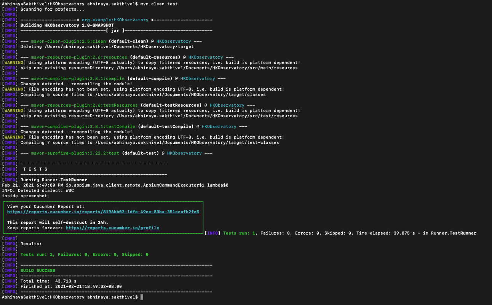

# HKObservatory

# Hardware
* MacOs Cataline 10.15.6
* Android device

# Software
* Java 1.8.0
* Cucumber 6.9.1
* Appium 1.17.1-1
* Android 9
* IntelliJ IDEA 2020.2.1
* Appium Inspector
  * Desired Capabilities details
  ```
  {
  "platformName": "Android",
  "platformVersion": "9",
  "app": "/Users/abhinaya.sakthivel/Downloads/MyObservatory_base.apk",
  "deviceName": "87ea971f",
  "automationName": "UiAutomator2",
  "appPackage": "hko.MyObservatory_v1_0",
  "appActivity": "hko.MyObservatory_v1_0.AgreementPage"
}

# Steps to run the test
1. Download the app from play store
1. Extract the apk and store it in the local
1. Connect the real device
1. Start Appium, set the host as '127.0.0.1', port as '4727'
1. In terminal, run the command mvn clean test

6. Find test result at build/reports/tests/cucumber-extent/cucumber_report.html
